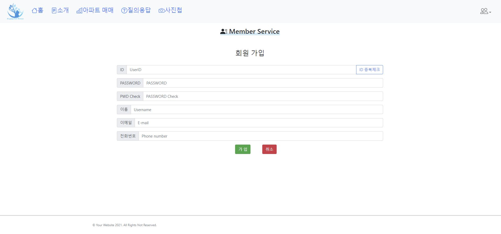

# Happy House

 
 

주제 : 반려동물을 기르는 사용자에게 아파트 매매 정보를 제공하는 웹 서비스

개발 기간 : 21.11.18 ~ 21.11.25

팀원 : 임혁(아파트 거래정보 부분), 안상현(회원가입, 로그인 부분)

 
 
 

## Service

* 새로운 거주지를 찾는 클라이언트에게 아파트 매매정보를 제공한다.
* 아파트 주변 동물과 관련된 편의시설을 제공한다.
* 회원가입과 로그인이 필요하다.

 

## 사용 기술

프론트엔드

* Vue.js
* Bootstrap
* javaScript

백엔드

* Java
* Springboot
* Mybatis

협업 툴

* GitLab
* Notion

 

## Timeline

## Detail

#### 메인 화면

* Welcome page

 

#### 회원가입

* 기본적인 회원가입 기능을 구현했다.

* 사용자의 정보를 DB에 저장한다.

  

 

#### 로그인

* JWT를 사용했다.

*  Session Storage에 사용자의 아이디, 이름을 저장하여 로그인 기능을 구현했다.

  

 

#### 아파트 매매 페이지

* 동 별 아파트 거래 정보를 보여준다.

* KakaoMap Api와 공공데이터를 이용했다.

* 지도의 중심에서 가장 가까운 동물병원, 공원을 각각 최대 30개씩 보여준다.

  

##### 상세

* 아파트 클릭시 상세 정보를 보여준다

  

 

* 마커 클릭시 간결한 정보를 표시하고 Kakao Map과 Kakao Navi를 연결한 버튼을 보여준다.

  

 

#### 질의응답

* 게시판을 구현하고 로그한 사용자만 접근할 수 있다.

  

 

#### 사진첩

* 보리가 귀여워서 넣었다.

  

